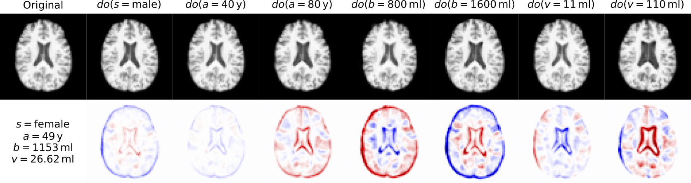

# Deep Structural Causal Models for Tractable Counterfactual Inference

[](https://arxiv.org/abs/2006.06485)
[](https://colab.research.google.com/github/biomedia-mira/deepscm/blob/master/deepscm/experiments/plotting/ukbb/interactive_plots.ipynb)



This repository contains the code for the paper
> N. Pawlowski<sup>+</sup>, D. C. Castro<sup>+</sup>, B. Glocker. _Deep Structural Causal Models for Tractable Counterfactual Inference_. Advances in Neural Information Processing Systems. 2020 [[arXiv]](https://arxiv.org/abs/2006.06485)

(<sup>+</sup>: joint first authors)

If you use these tools or datasets in your publications, please consider citing the accompanying paper with a BibTeX entry similar to the following:

```
@inproceedings{pawlowski2020dscm,
    author = {Pawlowski, Nick and Castro, Daniel C. and Glocker, Ben},
    title = {Deep Structural Causal Models for Tractable Counterfactual Inference},
    year = {2020},
    booktitle={Advances in Neural Information Processing Systems},
}
```

## Structure
This repository contains code and assets structured as follows:

- `deepscm/`: contains the code used for running the experiments
    - `arch/`: model architectures used in experiments
    - `datasets/`: script for dataset generation and data loading used in experiments
    - `distributions/`: implementations of useful distributions or transformations
    - `experiments/`: implementation of experiments
    - `morphomnist/`: soft link to morphomnist tools in submodules
    - `submodules/`: git submodules
- `assets/`
    - `data/`:
        - `morphomnist/`: used synthetic morphomnist dataset
        - `ukbb/`: subset of the ukbb testset that was used for the counterfactuals 
    - `models/`: checkpoints of the trained models

## Requirements
We use Python 3.6.8 for all experiments and you will need to install the following packages:
```
pip install numpy pandas pytorch-lightning>=0.7.6 scikit-image scikit-learn scipy seaborn tensorboard torch torchvision
pip install git+https://github.com/pyro-ppl/pyro.git@4b2752f829dbe12a3698b1cac81b300a7c682f63
```
or simply run `pip install -r requirements.txt`.
You will also need to sync the submodule: `git submodule update --recursive --init`.

## Usage

We assume that the code is executed from the root directory of this repository.

### Morpho-MNIST

You can recreate the data using the data creation script as:
```
python -m deepscm.datasets.morphomnist.create_synth_thickness_intensity_data --data-dir /path/to/morphomnist -o /path/to/dataset
```
where `/path/to/morphomnist` refers to the directory containing the files from the original MNIST dataset with the `original` morphometrics from [Morpho-MNIST](https://github.com/dccastro/Morpho-MNIST) dataset. Alternatively we provide the generated data in `data/morphomnist`. You can then train the models as:
```
python -m deepscm.experiments.morphomnist.trainer -e SVIExperiment -m {IndependentVISEM, ConditionalDecoderVISEM, ConditionalVISEM} --data_dir /path/to/data --default_root_dir /path/to/checkpoints --decoder_type fixed_var {--gpus 0}
```
where `IndependentVISEM` is the independent model, `ConditionalDecoderVISEM` is the conditional model and `ConditionalVISEM` is the full model. The checkpoints are saved in `/path/to/checkpoints` or the provided checkpoints can be used for testing and plotting:
```
python -m deepscm.experiments.morphomnist.tester -c /path/to/checkpoint/version_?
```
where `/path/to/checkpoint/version_?` refers to the path containing the specific [pytorch-lightning](https://github.com/PyTorchLightning/pytorch-lightning) run. The notebooks for plotting are situated in [`deepscm/experiments/plotting/morphomnist`](deepscm/experiments/plotting/morphomnist).

### UKBB

We are unable to share the UKBB dataset. However, if you have access to the UK Biobank or a similar dataset of brain scans, you can then train the models as:
```
python -m deepscm.experiments.medical.trainer -e SVIExperiment -m ConditionalVISEM --default_root_dir /path/to/checkpoints --downsample 3 --decoder_type fixed_var --train_batch_size 256 {--gpus 0}
```
The checkpoints are saved in `/path/to/checkpoints` or the provided checkpoints can be used for testing and plotting:
```
python -m deepscm.experiments.medical.tester -c /path/to/checkpoint/version_?
```
The notebooks for plotting are situated in [`deepscm/experiments/plotting/ukbb`](deepscm/experiments/plotting/ukbb).
